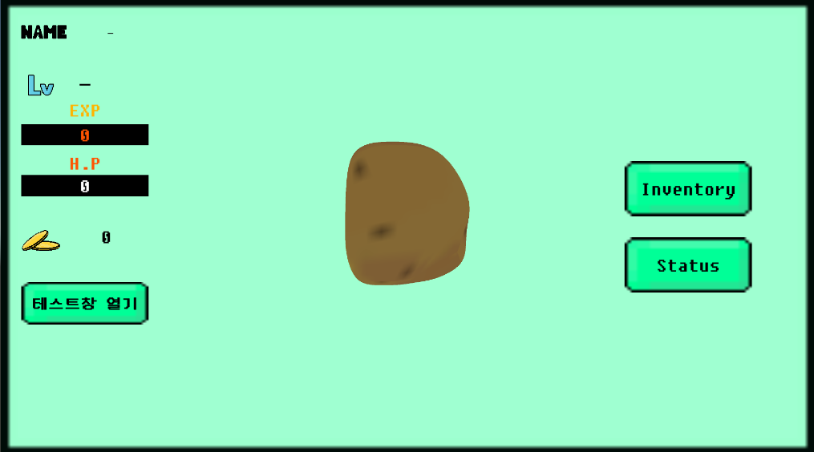
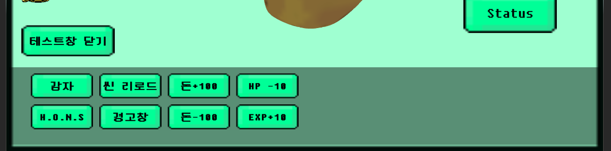
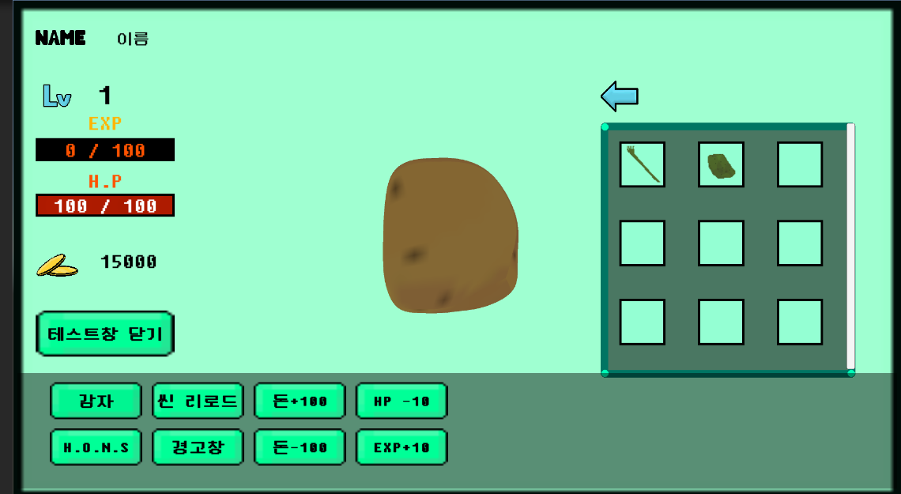

테스트창을 열어 테스트 해보세요

모든 조작은 마우스 좌클릭으로 이루어집니다.

인벤토리를 열고 아이템을 추가 해보세요

아이템을 강화 해 보세요
포텐셜은 강화 실패 시 1씩 차감되고 0이되면 강화가 불가능 합니다.

초기 와이어 프레임입니다. 

초기 클래스 다이어그램입니다.
StatData와 StatHandler 는 강의의 것을 복사해 와서 활용 해 보았습니다. 
더 좋은 구조를 만들거나 찾아내기 전에는 두고두고 사용할 것 같습니다. 
